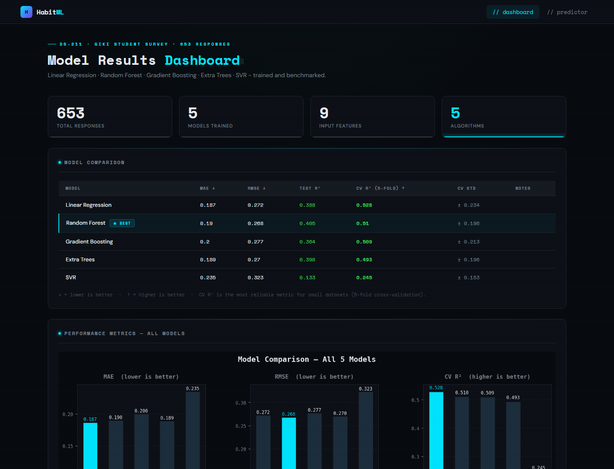
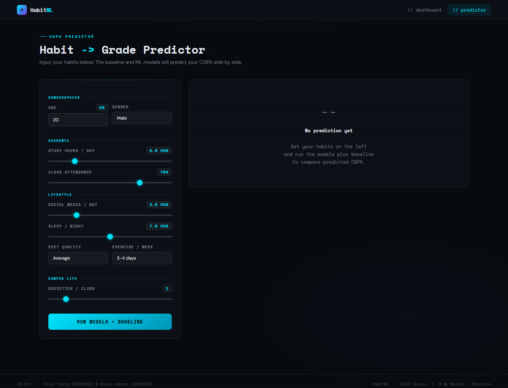

# Habits to Grades

> **Can student lifestyle habits predict academic performance?**  
> An end-to-end machine learning web app built from a GIKI student habits survey.


---

## Overview

Habits to Grades trains and compares **5 regression models** to estimate a student's CGPA from 9 behavioral and demographic features: study hours, attendance, sleep, social media usage, diet quality, exercise frequency, society involvement, age, and gender.

The project ships as an interactive Flask dashboard with:

- A **model comparison table** with MAE, RMSE, Test R^2, CV R^2, and CV standard deviation
- Auto-generated **model performance**, **feature importance**, **correlation heatmap**, and **cross-validation stability** charts
- A **live CGPA predictor** that sends habits to a JSON API and returns predictions from the trained models

---

## Screenshots

### Model Dashboard



### Live Predictor



---

## Dataset

| Attribute | Value |
| --- | --- |
| Source | Google Forms survey of GIKI students |
| Responses | 653 anonymized records |
| CGPA range | 2.0 to 4.0 |
| Collection period | April to May 2026 |
| Published file | `cleaned_student_habits.csv` |


**Features used for modeling:**

| Feature | Type | Notes |
| --- | --- | --- |
| Age | Numeric | Student age |
| Gender | Categorical | Encoded as numeric categories |
| Study Hours | Numeric | Hours per day, parsed from free-text/range responses |
| Attendance % | Numeric | 0 to 100 |
| Social Media | Numeric | Hours per day |
| Sleep Hours | Numeric | Hours per night |
| Diet Quality | Ordinal | Very Poor to Excellent, encoded 0 to 4 |
| Exercise | Ordinal/Numeric | Weekly frequency mapped to numeric midpoint |
| Societies | Numeric | Count of clubs/societies joined |

---

## Methodology

1. **Data anonymization**
   Raw survey exports include identifying fields, so the public workflow uses `cleaned_student_habits.csv`, which removes names and timestamps before modeling.

2. **Data cleaning**
   The loader standardizes column names, parses numeric text/range answers, converts CGPA and attendance to numeric values, and drops rows missing required modeling fields.

3. **Feature engineering**
   Categorical and ordinal survey answers are converted into model-ready values:
   - Gender is label-encoded.
   - Diet quality is mapped from 0 to 4.
   - Exercise frequency is mapped to weekly numeric midpoints.
   - Society membership is converted into a count.

4. **Model training**
   The project trains five regressors:
   - Linear Regression
   - Random Forest Regressor
   - Gradient Boosting Regressor
   - Extra Trees Regressor
   - Support Vector Regressor

5. **Evaluation**
   Models are compared using a held-out test split and 5-fold cross-validation:
   - **MAE**: average absolute prediction error
   - **RMSE**: larger-error-sensitive prediction error
   - **Test R^2**: variance explained on the held-out test set
   - **CV R^2**: average R^2 across 5 validation folds
   - **CV Std**: stability of the cross-validation score

6. **Model caching**
   On first run, the models are trained and saved to `models/trained.pkl`. Later runs load that pickle cache instantly unless `--retrain` is passed.

7. **Visualization**
   Matplotlib and Seaborn generate model comparison, feature coefficient, feature importance, cross-validation, and correlation charts into `static/plots/`.

---

## Models

| Model | Key Hyperparameters | Scaling |
| --- | --- | --- |
| Linear Regression | Default | None |
| Random Forest | `n_estimators=200`, `max_depth=6`, `min_samples_leaf=3` | None |
| Gradient Boosting | `n_estimators=200`, `max_depth=3`, `learning_rate=0.05` | None |
| Extra Trees | `n_estimators=200`, `max_depth=6`, `min_samples_leaf=3` | None |
| SVR | `kernel=rbf`, `C=10`, `epsilon=0.05`, `gamma=scale` | StandardScaler |

---

## Key Findings

- **Attendance** is one of the strongest predictors of CGPA.
- **Study hours** show a positive relationship with academic performance.
- **Social media usage** tends to correlate negatively with CGPA.
- **Diet and exercise** show weaker but directionally useful signals.
- Linear and tree-based models both perform meaningfully, suggesting the dataset contains a mix of linear and non-linear patterns.

---

## Project Structure

```text
habits_to_grades/
+-- app.py                         # Flask routes, prediction API, model cache loading
+-- cleaned_student_habits.csv     # Public anonymized dataset
+-- requirements.txt               # Python dependencies
+-- models/
|   +-- train_models.py            # Data cleaning, feature engineering, model training
|   +-- charts.py                  # Matplotlib/Seaborn chart generation
+-- templates/
|   +-- base.html                  # Shared layout
|   +-- index.html                 # Dashboard page
|   +-- predict.html               # Live predictor page
+-- static/
|   +-- plots/                     # Generated charts, ignored by Git
+-- docs/
|   +-- screenshots/               # README screenshots
+-- notebooks/
    +-- eda.ipynb                  # Exploratory data analysis
```

---

## Quick Start

```bash
# 1. Clone
git clone https://github.com/A-1K/tds-proj-student-cgpa-predictor.git
cd habits_to_grades

# 2. Create a virtual environment
python -m venv venv
source venv/bin/activate   # Windows: venv\Scripts\activate

# 3. Install dependencies
pip install -r requirements.txt

# 4. Run
python app.py
# Open http://127.0.0.1:5000
```

On first run, all 5 models are trained and cached to `models/trained.pkl`. Subsequent starts load the cache. To force a retrain:

```bash
python app.py --retrain
```

---

## Limitations

- The dataset is self-reported and may contain response bias.
- Results reflect one campus context and may not generalize to other universities.
- Lifestyle habits alone cannot fully explain academic performance.
- Predictions should be interpreted as exploratory estimates, not academic advice.

---

## Course Context

Built as the final semester project for **DS-211 Theory of Data Science** at [GIK Institute of Engineering Sciences and Technology](https://www.giki.edu.pk/).

---

## License

[MIT](LICENSE)
